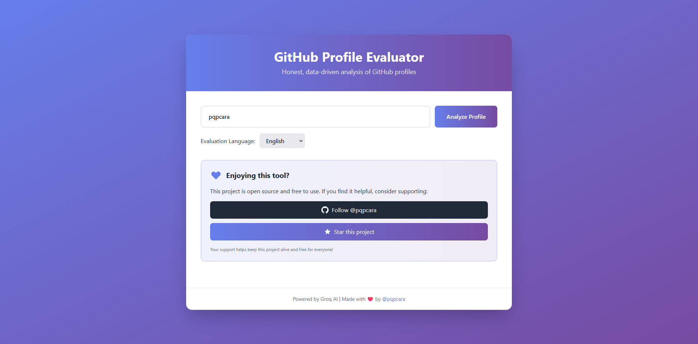
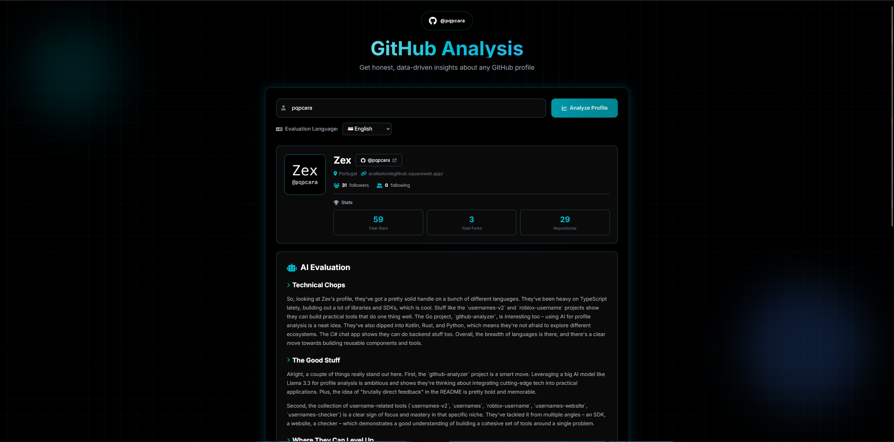

# GitHub Profile Evaluator

> Honest, AI-powered analysis of GitHub profiles with brutally direct feedback

A professional web application that analyzes GitHub profiles using Groq AI (Llama 3.3 70B) to provide data-driven insights, strengths, weaknesses, and actionable recommendations.


## Screenshots

### Home Page


### Analysis Result


## Features

- **AI-Powered Analysis**: Uses Groq's Llama 3.3 70B model for intelligent, human-like evaluation
- **Repository Deep Dive**: Analyzes folder structure and README content of each repository
- **Smart Prompt Splitting**: Automatically splits large profiles into two API calls if needed
- **Natural Language**: Responses sound like a real developer, not corporate AI
- **Multi-Language Support**: Interface and evaluation in 7 languages (EN, PT, ES, FR, DE, JA, ZH)
- **Comprehensive Evaluation**: Analyzes repositories, documentation, activity, and market perception
- **Modern UI**: Beautiful, responsive interface built with Tailwind CSS
- **Language Persistence**: Remembers your language preference via cookies
- **REST API**: Full API access for integration with other tools
- **No Rate Limits**: Uses Groq's generous free tier

## Quick Start

### Prerequisites

- Go 1.21 or higher
- Groq API Key (free at [console.groq.com](https://console.groq.com/keys))
- Optional: GitHub Token (to avoid rate limits)

### Installation

```bash
# Clone the repository
git clone https://github.com/pqpcara/github-analyzer.git
cd github-analyzer

# Install dependencies
go mod download

# Configure environment
cp .env.example .env
```

### Configuration

Edit `.env` file:

```env
# Groq API Key (REQUIRED)
# Get it at: https://console.groq.com/keys
GROQ_API_KEY=groq_api_key

# GitHub Token (OPTIONAL - helps avoid rate limits)
# Get it at: https://github.com/settings/tokens
GITHUB_TOKEN=api_key

# Optional: Custom port (default: 8080)
PORT=8080
```

### Run

```bash
go run main.go
```

### Docker

```bash
docker build -t github-analyzer .
docker run -p 8080:8080 -e GROQ_API_KEY=groq_api_key -e GITHUB_TOKEN=github_api_key github-analyzer
```

Server will start on `http://localhost:8080`

## API Documentation

### Evaluate Profile

**Endpoint:** `POST /api/evaluate`

**Request:**
```json
{
  "username": "torvalds",
  "language": "en"
}
```

**Response:**
```json
{
  "success": true,
  "profile": {
    "username": "torvalds",
    "name": "Linus Torvalds",
    "bio": "...",
    "followers": 150000,
    "following": 0,
    "public_repos": 5,
    "avatar_url": "https://...",
    "repositories": [...]
  },
  "evaluation": "## Technical Assessment\n..."
}
```

**Language Codes:**
- `en` - English
- `pt` - Português
- `es` - Español
- `fr` - Français
- `de` - Deutsch
- `ja` - 日本語
- `zh` - 中文

### Health Check

**Endpoint:** `GET /health`

**Response:**
```json
{
  "status": "healthy"
}
```

## Features in Detail

### AI Evaluation Sections

1. **Technical Assessment**: Code quality, tech stack diversity, project complexity
2. **Profile Strengths**: What stands out with specific examples
3. **Critical Weaknesses**: Areas needing improvement (no sugar-coating)
4. **Recommendations**: Concrete, prioritized actions
5. **Market Perception**: How recruiters/hiring managers view the profile

### Repository Analysis

For each repository, the system now analyzes:
- **Folder Structure**: Lists all files and directories in the root
- **README Content**: Reads and includes README.md content (up to 500 chars preview)
- **Technologies**: Identifies programming languages and frameworks
- **Topics/Tags**: Extracts repository topics for better categorization

This provides much deeper insights into code organization and project quality.

### Multi-Language Interface

The entire interface automatically translates when you change the language:
- All UI text and labels
- Placeholders and buttons
- Error messages
- Support card content

Your language preference is saved in cookies and restored on next visit.

## Tech Stack

- **Backend**: Go (net/http)
- **AI**: Groq API (Llama 3.3 70B)
- **Frontend**: Vanilla JavaScript, Tailwind CSS
- **Data Source**: GitHub REST API

## Contributing

Contributions are welcome! Please feel free to submit a Pull Request.

1. Star the repository
2. Fork the repository
3. Create your feature branch (`git checkout -b feature/AmazingFeature`)
4. Commit your changes (`git commit -m 'Add some AmazingFeature'`)
5. Push to the branch (`git push origin feature/AmazingFeature`)
6. Open a Pull Request

## Contact

Created by [@pqpcara](https://github.com/pqpcara)

If you find this project helpful, consider:
- Starring the repository
- Reporting bugs
- Suggesting new features
- Contributing code

---

**Made with ❤️ by [@pqpcara](https://github.com/pqpcara)**
